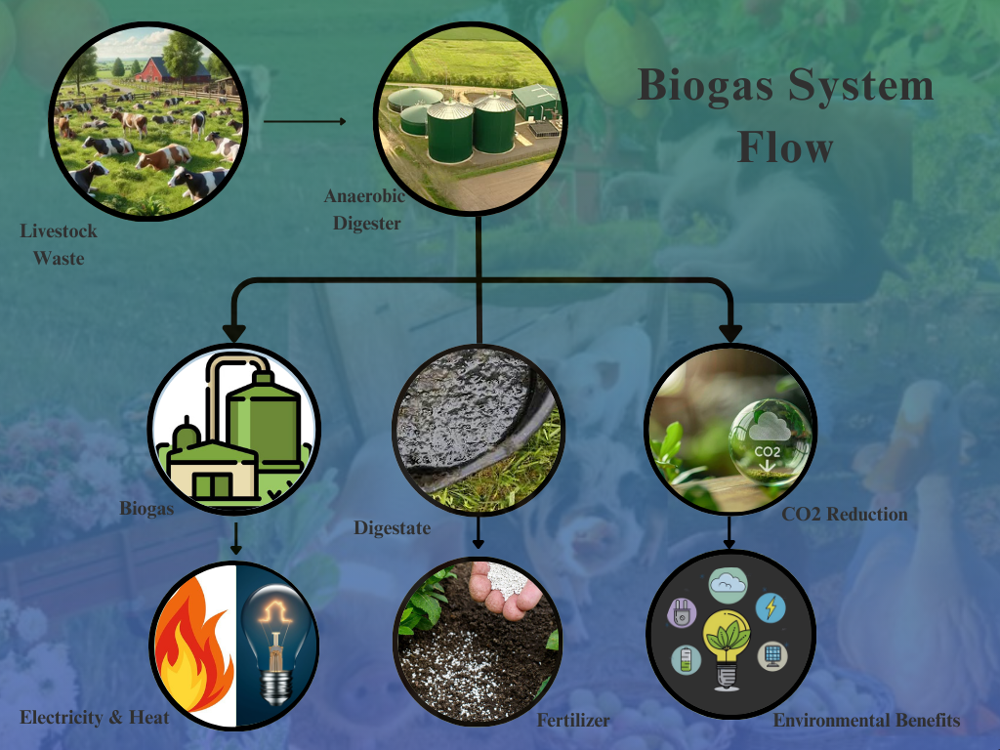
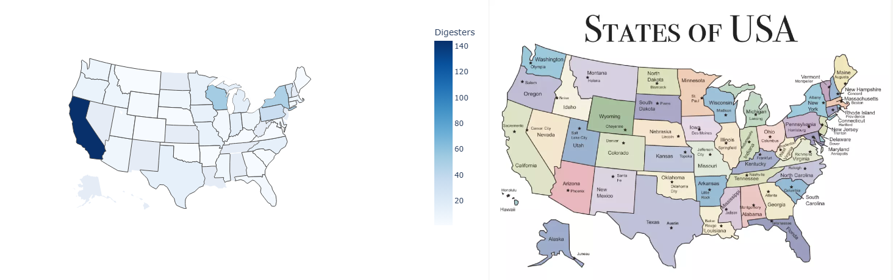
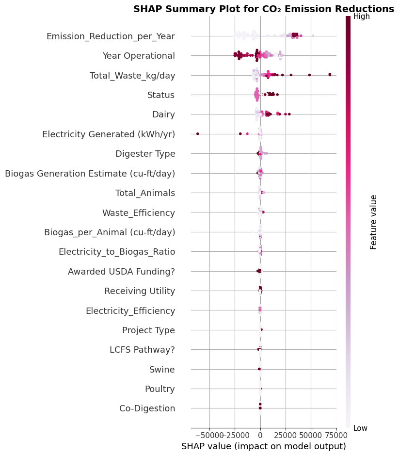
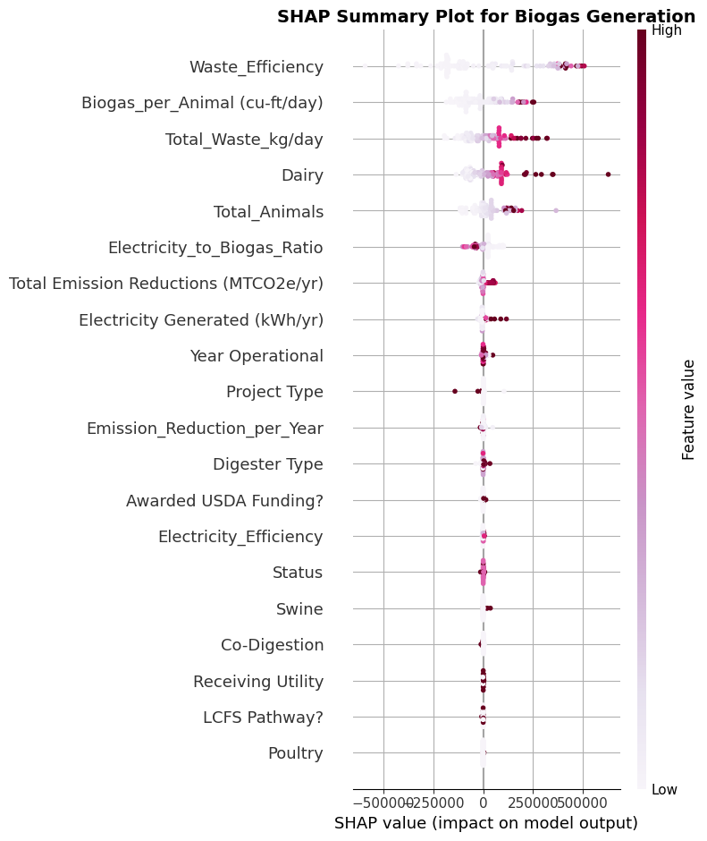
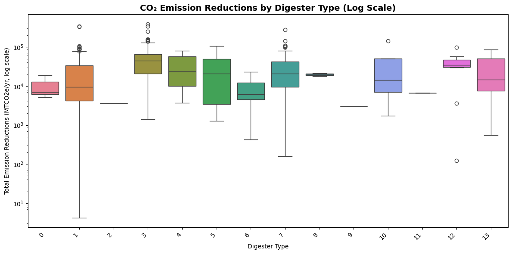
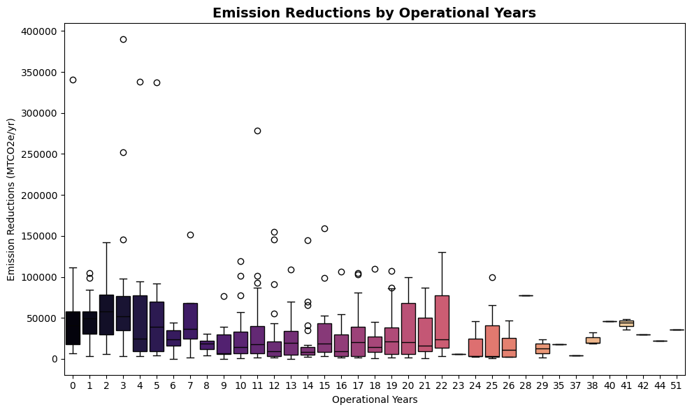
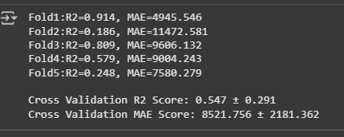
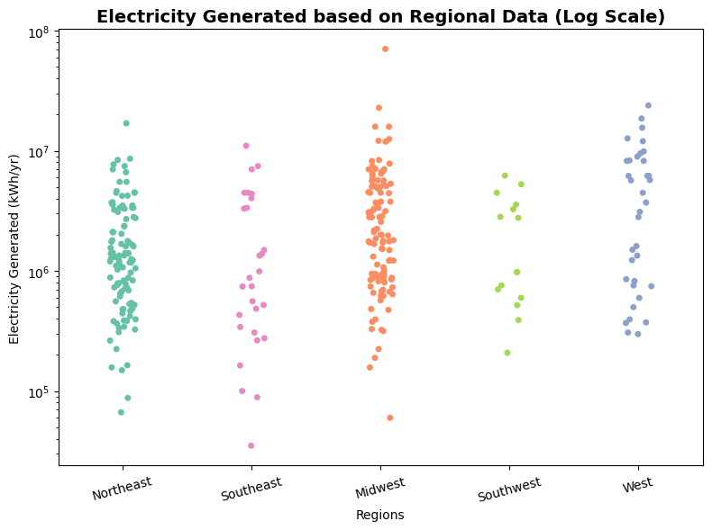
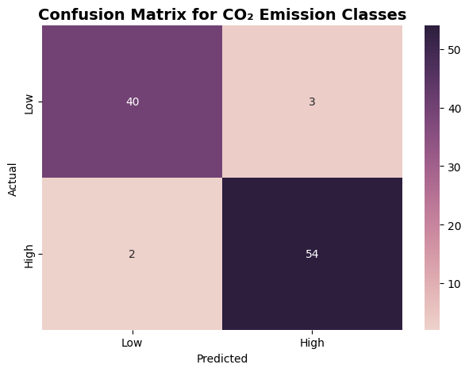
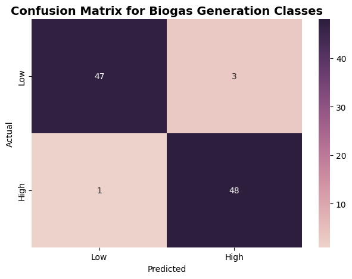

# From Waste to Watts: Predictive Modelling and Environmental Insights from US Livestock Farms

MSc Applied Data Science dissertation project (Anglia Ruskin University, Cambridge, UK) predicting biogas/electricity generation and CO2 emission reduction from anaerobic digesters on US livestock farms, using machine learning on farm-, digester-, and region-level features.

## Overview

Anaerobic digesters convert livestock waste into biogas, which can be used to generate electricity while reducing greenhouse gas emissions. This project builds regression and classification models to:

- Predict **electricity generation (kWh/yr)** and **biogas output** from digester and farm characteristics
- Predict and classify **CO2 emission reduction** performance across digesters
- Identify which features most influence emissions and energy output (via SHAP analysis)
- Explore geographic and regional patterns in digester performance across the US

## Methodology

- **Data cleaning & preprocessing** — encoding categorical digester/farm attributes, handling missing values
- **Exploratory analysis** — distribution of digester types, regional breakdowns of biogas/electricity generation
- **Modelling** — `XGBRegressor` models with K-Fold cross-validation for electricity generation and CO2 emission reduction
- **Feature importance** — SHAP values to interpret which factors drive emissions and energy output
- **Classification** — categorising digesters into performance tiers, evaluated with classification reports and confusion matrices
- **Geographic analysis** — interactive choropleth mapping (branca/folium) of emission reduction and digester performance by US state/region

## Key results

| | |
|---|---|
|  |  |
| Project pipeline | Regional digester performance across the US |
|  |  |
| SHAP summary plot | Feature importance for emission/output prediction |
|  |  |
| CO2 emission reduction by digester type | CO2 emission reduction by operational years |
|  |  |
| K-Fold cross-validation performance | Electricity generation results |
|  |  |
| Classification: CO2 emission tiers | Classification: biogas output tiers |

An interactive map of emission reduction by top-performing digesters is included in [`emission_reduction_map.html`](emission_reduction_map.html) — download and open it in a browser to explore.

## Tech stack

Python · pandas · NumPy · XGBoost · scikit-learn · SHAP · matplotlib/seaborn · branca/folium (geographic mapping) · Jupyter Notebook

## Data

The dataset used is the [Livestock Anaerobic Digester Database](https://www.epa.gov/agstar/livestock-anaerobic-digester-database), maintained by the US EPA's AgSTAR program, accessed via a [Kaggle mirror](https://www.kaggle.com/datasets/mehmetisik/livestock-anaerobic-digester-database). As US federal government data, it is in the public domain. It is not redistributed directly in this repository — the notebook documents the exact preprocessing steps applied, so the pipeline can be reproduced by downloading the dataset from either source above.

## Full write-up

The complete dissertation is included as [`From_Waste_to_Watts_Thesis.pdf`](From_Waste_to_Watts_Thesis.pdf), covering the literature review, full methodology, and discussion of results.

## Contents

```
waste_to_watts_modelling.ipynb   # Full analysis: preprocessing, modelling, SHAP, classification, mapping
emission_reduction_map.html      # Interactive geographic visualization
From_Waste_to_Watts_Thesis.pdf   # Full dissertation write-up
images/                          # Key result charts referenced above
```
